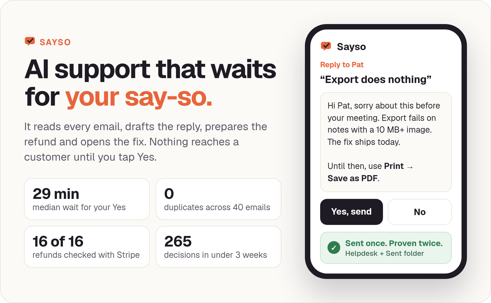
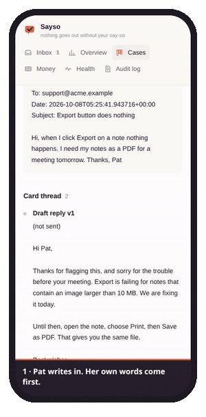
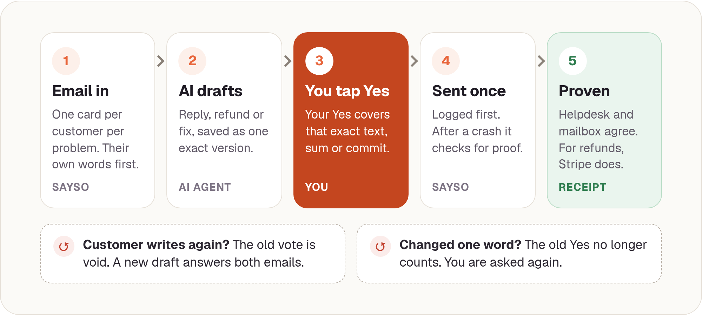
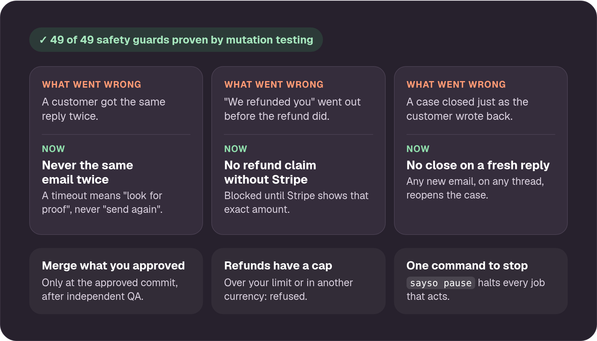
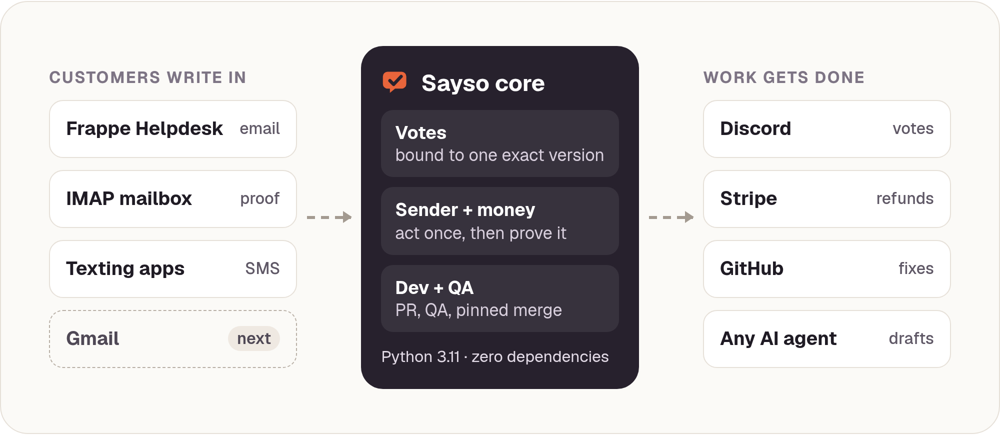

<p align="center">
  
</p>

<p align="center">
  <a href="#quick-start"><b>Try it in 60 seconds</b></a> ·
  <a href="#how-it-works">How it works</a> ·
  <a href="#built-from-real-mistakes">Safety</a> ·
  <a href="#works-with-your-stack">Integrations</a> ·
  <a href="docs/QUICKSTART.md">Docs</a>
</p>

<p align="center">
  
  
  
  
  
</p>

---

**Sayso is an open-source support loop for small teams.** The AI does the work:
it reads every customer email, groups it, drafts the answer, prepares the refund
and opens the fix. **You make every decision** with one tap on your phone. Then
Sayso sends it exactly once and proves it left.

No autopilot replies. No refunds nobody approved. No "we fixed it" before it
shipped.

<p align="center">
  
  <br><sub>The real Sayso console on a phone, with a demo product and test customers.</sub>
</p>

<p align="center">
  <a href="assets/sayso-demo-video.mp4"></a>
  <br><sub>Sayso in a Discord workspace (demo team, made-up customer). <a href="assets/sayso-demo-video.mp4">Watch with sound (MP4, 31 s)</a>. Slack support is on the roadmap.</sub>
</p>

## Why Sayso

Support automation usually fails one of two ways. Either the AI answers
customers on its own and you find its mistakes after they do, or a human stays
in the loop for everything and the team drowns.

Sayso takes the middle path:

- **It does the chores.** Intake, drafting, chasing, sending, checking and
  closing all run on their own.
- **You keep the judgement.** Every email, refund, cancellation, code merge and
  case close waits for a Yes on the **exact** version. Change one word and you
  are asked again.
- **It shows its receipts.** An email counts as sent only when the helpdesk and
  the mailbox's own Sent folder agree. A refund counts only when Stripe agrees.

## In production

Sayso runs customer support for [PhonicsMaker](https://phonicsmaker.com), a
two-person edtech company. From 20 September to 8 October 2026 it handled
**212 cases from 140 customers**:

| | |
|---|---|
| Support decisions made | **265** |
| Median time to a human Yes or No | **29 minutes** |
| Customer emails sent / duplicates | **40 / 0** |
| Refunds and cancellations checked against Stripe | **16 / 16** |
| Approvals cancelled automatically because something changed first | **39** |

One founder approved almost all of them from a phone.

## How it works

<p align="center">
  
</p>

1. **Email in.** One card per customer per problem, opened with the customer's
   own words, never an AI summary first.
2. **AI drafts.** The reply, refund or fix is written, checked against your
   rules, and saved as one immutable version.
3. **You tap Yes.** In Discord or the Sayso console. Your Yes is fingerprinted
   to that exact text, amount or commit.
4. **Sent once.** The attempt is recorded before anything goes out. After a
   crash or a timeout, Sayso looks for proof. It never resends blindly.
5. **Proven.** Two independent records must agree before the case moves on.

Bugs follow the same path: a bounded coding run opens a pull request and stops,
an independent QA run checks that exact commit, and the merge waits for your Yes.

## Built from real mistakes

<p align="center">
  
</p>

Every safety guard in Sayso exists because its absence once hurt a real
customer. Each guard is **mutation-tested**: `scripts/mutate.py` removes the
guards one at a time from a scratch copy, and a test must fail every time. If a
guard can be deleted with the tests still green, the build fails. The full list
is in [docs/SAFETY.md](docs/SAFETY.md).

## Works with your stack

<p align="center">
  
</p>

| Role | Reference adapter | Fake for tests |
|---|---|---|
| Where you approve | Discord forum + polls, or the Sayso console | ✅ |
| Conversation of record | Frappe Helpdesk, or a texting product (Baker) | ✅ |
| Independent proof of send | Any IMAP mailbox's Sent folder | ✅ |
| Refunds and cancellations | Stripe | ✅ |
| Pull requests and merges | GitHub | ✅ |
| Drafts, coding and QA runs | Any AI agent; we use [Hermes Agent](https://hermes-agent.nousresearch.com) | ✅ |

Using Zendesk, Help Scout, Slack, Linear or GitLab? Each connection is one
small class; see [docs/ADAPTERS.md](docs/ADAPTERS.md). The core and its tests
do not change.

## Quick start

No accounts, no keys, nothing real touched:

```bash
git clone https://github.com/harrythentrepreneur/sayso.git
cd sayso
pip install -e .

sayso demo                 # one fake customer, from first email to closed case
sayso dashboard --demo     # the console with demo data: http://127.0.0.1:8765/
```

```text
1. Customer writes in.
2. Support hands the bug to dev; the drafted reply vote is voided.
3. Operator approves the refund of the duplicate charge (exact amount in the vote).
    money     {'money:...:refund:ch_demo0001': 'VERIFIED_WITH_PROVIDER'}
4. Operator approves the merge of the exact PR head; the loop re-drafts the reply.
5. Operator approves the exact reply; it is sent once and verified.
    sender    {'reply:...:v2': 'SENT_AND_VERIFIED'}
6. Four quiet days later a close vote opens; operator approves.

DEMO PASS - emails sent: 1, refunds: 1, alerts: 0
```

To bring up your own product on fakes, copy `examples/acme-dry-run.toml` and
follow **[docs/QUICKSTART.md](docs/QUICKSTART.md)**. A test runs those exact
steps on every change. When you are ready for real systems, follow
[docs/ONBOARDING.md](docs/ONBOARDING.md) and switch one adapter at a time.

## Everything in the box

- **One card per customer per problem.** A second email joins the same card; a product failure never folds into a billing thread.
- **Votes bound to one exact version.** Draft hash, refund spec or PR head. Anything changes, the vote is void.
- **Send once, prove twice.** Recorded before sending, re-read after a crash, never re-sent.
- **Money behind a vote.** Capped, limited to listed currencies, read back from the provider.
- **Dev hand-off with QA.** A bounded coding run opens a PR, independent QA checks that head, the merge is pinned to it.
- **Quiet close.** After N quiet days a close vote opens; any new email from the customer voids it.
- **Web console.** Inbox, overview, cases, money, health and audit log. Operators can sign in and vote from a phone.
- **Plugins.** Product-only rules stay out of the core.
- **Fakes by default.** Nothing real is touched until `mode = "live"`.
- **One-command pause.** `sayso pause` stops every job that acts; reporting keeps running.
- **Zero dependencies.** Python 3.11 standard library only.

## Settings in one file

```toml
[product]
name = "Acme Notes"
slug = "acme"
mode = "dry-run"                       # real adapters need "live"
support_address = "support@acme.example"

[operators]                            # only these people can approve
"000000000000000001" = "Owner"

[board]
adapter = "discord"
forum_id = "000000000000000010"
token_env = "ACME_DISCORD_TOKEN"       # a variable NAME, never the secret

[policy]
quiet_close_days = 3
refund_max_minor = 10000               # largest refund, in cents
currencies = ["usd"]
```

Sayso refuses unknown keys, secrets written into the file, and real adapters in
dry-run mode. Every key is described in [docs/SETTINGS.md](docs/SETTINGS.md).

## Documentation

| Guide | For |
|---|---|
| [Quickstart](docs/QUICKSTART.md) | A new product on fakes, step by step |
| [Onboarding](docs/ONBOARDING.md) | Connecting real systems, and the go-live checklist |
| [Settings](docs/SETTINGS.md) | Every key in the settings file |
| [Architecture](docs/ARCHITECTURE.md) | Parts, jobs, state files, crash safety |
| [Stages](docs/STAGES.md) | Board tags, legal moves, votes |
| [Safety](docs/SAFETY.md) | The approval model, and each guard with its proof |
| [Adapters](docs/ADAPTERS.md) | Writing a connector, and vendor pitfalls |
| [Plugins](docs/PLUGINS.md) | Product-only logic |
| [Dashboard](docs/DASHBOARD.md) | The web console |
| [Install](docs/INSTALL.md) | systemd timers on Linux |
| [Runbook](docs/RUNBOOK.md) | Pause, alerts, recovery, key rotation |
| [Security](docs/SECURITY.md) | Secrets, data, threat model |
| [FAQ](docs/FAQ.md) | Common questions |

## Roadmap

- [x] Core loop, votes, sender, money, dev hand-off with QA, quiet close
- [x] Mutation-tested safety guards
- [x] Web console with operator sign-in and votes from a phone
- [x] First live product (PhonicsMaker)
- [ ] Gmail as the inbox
- [ ] Slack and Zendesk adapters
- [ ] Hosted version for teams that do not want to run a server

## Contributing

Pull requests are welcome. Read [CONTRIBUTING.md](CONTRIBUTING.md) first: one
concern per commit, tests on fakes only, and a mutation run for any new guard.
Please follow the [Code of Conduct](CODE_OF_CONDUCT.md), and report security
problems privately as described in [SECURITY.md](SECURITY.md).

## Credits

Sayso's reference drafter, dev runner and QA runner use
[Hermes Agent](https://hermes-agent.nousresearch.com) by Nous Research, which
is how we run it at PhonicsMaker. Hermes is one adapter, not a requirement: the
core, the votes and the safety guards do not depend on it, and any agent that
can return a draft can be plugged in.

## Licence

Sayso is open source under the [Apache License 2.0](LICENSE). See
[NOTICE](NOTICE) for attribution.

<p align="center"><sub>Built by Harry and <a href="https://github.com/kaviru2">Kaviru Hapuarachchi</a>, who run PhonicsMaker's support with it every day.</sub></p>
